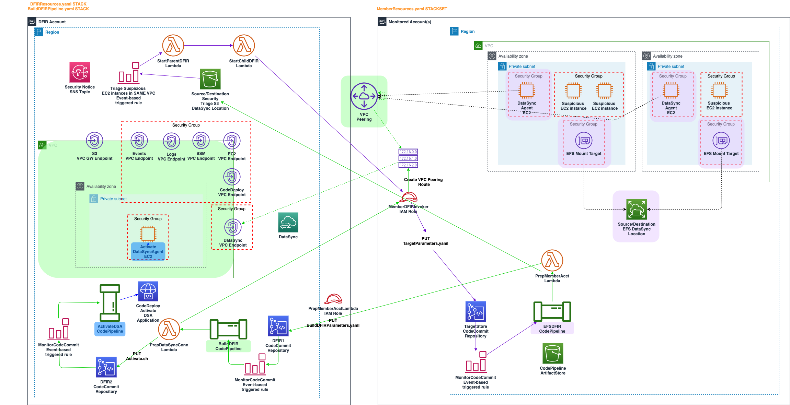
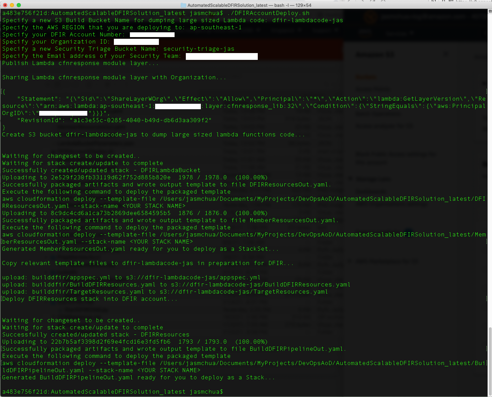
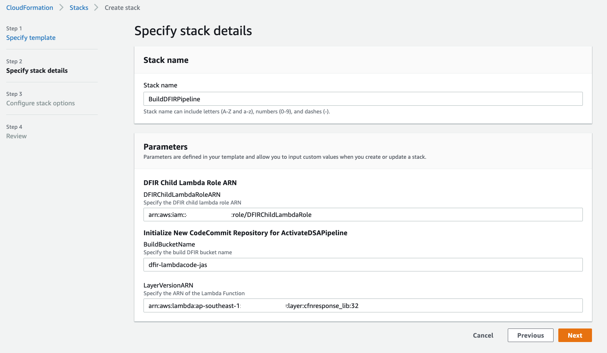
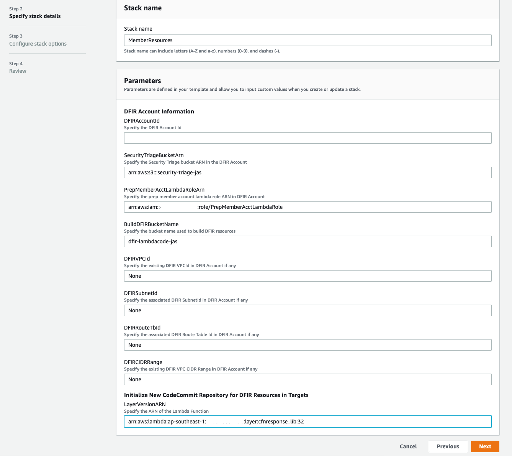

## Auto Cloud Digital Forensics Incident Response (DFIR)

## Background

The idea behind this solution is to build an automated and scalable infrastructure for DFIR purpose. Time is essence when it comes to security triage. Tier 1 security incident responders are often under pressure to quickly discern what abnormal looks like and decide whether to escalate further. Thus, this solution is focused on providing that dynamic infrastructure as code to support security incident responders so that they can quickly perform security triage on running EC2 instances with ease in AWS cloud.

When a real security incident is determined, business stakeholders are always most concerned about its impact level and time to recovery and they want to know it fast. They would care less about whether you have completed collecting all the full disk and memory forensic images because this technical action itself does not directly translate to business value. Moreover, the size of system disk and memory is growing exponentially, even though the collection of full disk and memory forensic images is much faster and can be automated in the cloud as opposed to on-premise, it also adds a lot more data for incident responders to process and analyze. Thus, a *"live" targeted* collection and response is often preferred as a start to keep the whole DFIR cycle agile in order to yield the fastest results for business stakeholders. The end goal of this solution aims to achieve this.

After you have almost all the pieces to the puzzle, that is when you can leverage your incident response playbook, collect and preserve all digital evidence if deemed necessary. By then, you would also have a better idea of which EC2 instances are affected/compromised and to collect from. Often times, unless it is for litigation purpose, it is not useful to simply collect everything.

A typical incident response runbook for a compromised EC2 instance would detail on how to isolate an EC2 instance, take an EBS snapshot of its volume storing in S3, encrypt it and share the snapshot back with the DFIR account for further preservation and analysis. However, it is worth highlighting that creating an EBS snapshot is neither able to capture any cached data that has been written to the volume after the "create-snapshot" API call is executed nor its instance store data. Incident response time is also lost while waiting for a snapshot to be created especially if it is a large sized EBS volume. Further, security incident responders would be challenged to capture the forensic memory images of running EC2 instances remotely in order to capture all their cached data. Think of fileless malware. 

Capturing a memory image on a running EC2 instance remotely may not be so much of a challenge if the EC2 instance is in a development environment. The challenge comes when the running EC2 instance is in production environment and it is hosting business critical workloads. The complexity increases when there are also multiple suspicious EC2 instances in different VPCs in multiple accounts that require human attention and investigation.

Performing a memory capture should never be triggered automatically in production because it may cause system unstability during the process. Thus, it should be manually triggered on production running EC2 instances and only upon business approval. There should also be other preventative guardrails in your incident response runbook such as creating EBS snapshots prior to memory capture. This is to prevent losing any production data on the running EC2 instances before actually dumping their memory. After the memory dump is completed, security incident responders should also verify the memory image. This means they need to attempt to parse the memory image using a forensic memory parser tool. This validation process can be time-consuming if these memory images are captured and stored directly to an S3 bucket because one needs to download them from the S3 bucket first. Given growing size of system memory, it can be painstakingly time-consuming to capture and validate too.

## Solution Outline

A *"live" targeted* DFIR focuses on capturing and preserving and parsing only relevant data from the file system and memory of a running EC2 instance for analysis. 

This solution is built to achieve this objective while ensuring that every step taken is forensically sound and there are minimal changes and disruptions made to the target EC2 instances. 

It provides the dynamic infrastructure by automating the creation of a brand new EFS file system and its mount targets in the target account. We can arguably share a forensics snapshot from DFIR account and create a new forensics volume in the Target account so that we can mount it to the suspicious EC2 instance. However, this solution is not fast and scalable when there are multiple suspicious EC2 instances that needs investigation. Moreover, forensics volume is limited in size and it takes time to create large sized volume. With an EFS file system, it allows multiple suspicious EC2 instances from different availability zones in the same VPC to mount the same shared file system and thus, their data can all be collected at the same time via automated scripts. 

The type of data to collect in a "live" targeted DFIR is only limited by your own imagination. For example, we can have all our triage scripts including compatible compiled LIME modules on the shared file system. We can then dump the system memory to the mounted shared file system and parse the completed memory image immediately after to validate that it is fine. As the memory image is written to a shared file system instead of local, it does minimal invasion to the original state of the suspicious running EC2 instance. Writing anything to local volume would possibly overwrite evidence in the unallocated space of the file system.

After data is collected in the shared file system, the solution also provides the means to leverage AWS DataSync to secure transfer data on the shared file system from the Target account to an S3 bucket back in our DFIR account. The beauty of using AWS DataSync is that it comes with forensics equivalent features including data integrity checksum verification, metadata copy preservation as well as detailed transfer task logging. All of these are useful in a DFIR process.

## DFIR Infrastructure Preparation Instructions

1. Build cfnresponse and urllib3 python static libraries. 

    pip install -r requirements.txt -t ./layer/
    cd ./layer && zip -r ../CFNResponse.zip .

2. Execute DFIRAccountDeploy.sh as administrator of your DFIR account

    `./DFIRAccountDeploy.sh`

3. Deploy BuildDFIRPipelineOut.yaml as Stack named "BuildDFIRPipeline" in your DFIR account. It is important to use this stack name otherwise, it will break the solution at a later stage. You can get the information for some of your input parameters from the Outputs of "DFIRResources" stack.

4. Deploy MemberResourcesOut.yaml as StackSet into Monitored Accounts. You can get the information for some of your input parameters from the Outputs of "DFIRResources" stack. **NOTE:** *If you have an existing VPC in your DFIR account, you need to declare your VPC details as input parameters as seen in the sample picture below.*  

**CAVEAT:** *Upon triggering for DFIR Infrastructure deployment to investigate suspicious EC2 instances, this solution will attempt to create a new VPC in your DFIR account and peer it with the target VPC in the Monitored account when your DFIR account does not have an active VPC peering connection with the target VPC in the Monitored account. This new VPC created will not conflict with the existing VPC details you declared above as input parameters in MemberResources.yaml. However, because this solution does not enumerate the VPCs in your DFIR account, it will not know about the other existing VPCs in your DFIR account and thus, it may conflict with them resulting in deployment failure. **This solution assumes that you only have a maximum of one existing VPC in your DFIR account prior to deployment.*** 

*If you already have an existing active VPC peering connection between the VPC in your DFIR account and the Monitored account, it would leverage it and it will not create a new VPC and peering. In this case, it would assume that the existing VPC details you declared above as input parameters in MemberResources.yaml is the VPC that is already peered with the VPC in the Monitored Account, it will not enumerate the VPCs in your DFIR account.*
    
## Assumptions - You can safely ignore this section if you do not have any existing VPC in your DFIR account

Your existing DFIR VPC (if any) does not have the following regional VPC/ S3 Gateway Endpoints:

    datasync
    codedeploy
    codedeploy-commands-secure
    ec2
    ssm
    ssmmessages
    ec2messages
    logs
    events
    s3

If your existing DFIR VPC already has any of the above endpoints, please delete the relevant VPC endpoint resources from builddfir/BuildDFIRResources.yaml prior to deployment.

## DFIR Infrastructure Deployment Instructions

1. Modify targetinstances.txt following the format below. NOTE: Each line of EC2 instances must belong to the same VPC. 

    > account1number=instance-id-1,instance-id-2,instance-id-3    
    > account2number=instance-id-1,instance-id-2

2. Upload targetinstances.txt to your Security Triage bucket (one of the variables in DFIRAccountDeploy.sh) in your DFIR account.

3. If there are EC2 instances from different VPCs, please upload targetinstances.txt to the S3 bucket again and again for each VPC i.e. a single upload per VPC.

## Post-Incident Instructions  

This section is meant for post-incident. It means that you have completed your targeted collection and transferred the relevant data via AWS DataSync back to your DFIR account. You wish to reset the infrastructure in your Monitored account to prepare for the next incident.

In this case, you need to only follow Tear Down Instructions A and B. In addition, you need to remove PeerInfo.txt and TargetInstances.txt files from your Security Triage bucket.

### Tear Down Instructions A - Tear Down EFS, EFS Mount Targets and DataSync Agent EC2 Instance in Monitored Account

1. You need to first manually remove the circular dependency in the Security Groups.
    For each "SecGrpEFSMountT" security group, delete the Inbound 2049/TCP NFS rule coming from Source "DataSyncAgentSecGrp"
    For each "DataSyncAgentSecGrp" security group, delete the Outbound rule 2049/TCP NFS rule going to "SecGrpEFSMountT"
2. Delete the "EFS-DFIR-Stack" stack from CloudFormation.

### Tear Down Instructions B - Tear Down VPC (if any newly created), VPC Endpoints and Activate DataSync Agent EC2 Instance in DFIR Account

Delete the "BuildDFIRResources" stack from CloudFormation.

### Tear Down Instructions C - Tear Down the Entire DFIR Infrastructure deployed

In the Member Account:
1. Ensure that EFSDFIRPipelinesolutionStore S3 bucket is emptied. 
2. Delete the "MemberResources" stack from CloudFormation.

In the DFIR Account:
1. Ensure that you have emptied BuildDFIRPipesolutionStore, Security Triage and the Lambda Code S3 buckets manually.
2. Delete the "BuildDFIRPipeline" stack from CloudFormation.
3. Delete the "DFIRResources" stack from CloudFormation.
4. Delete the "DFIRLambdaBucket" stack from CloudFormation.

## Contributing

Thanks for your interest in contributing! There are many ways to contribute to this project. Get started with [CONTRIBUTING](CONTRIBUTING.md).

## Security

See [CONTRIBUTING](CONTRIBUTING.md#security-issue-notifications) for more information.

## License

This library is licensed under the MIT-0 License. See the LICENSE file.

